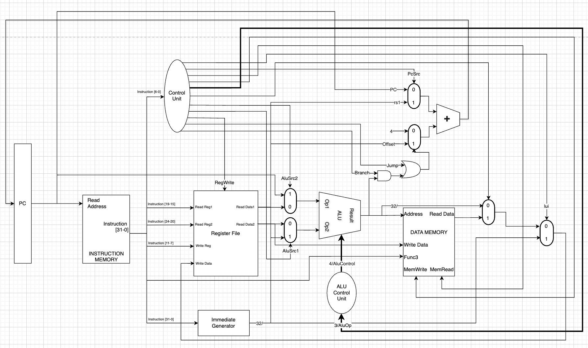

# RV32I Core (CS552 Project 3)

Concise Verilog RTL implementation of an RV32I hart for CS552 Project 3.

**Overview**
- RTL lives in `rtl/` with shared helper modules in `lib/`.
- Testbenches and reference artifacts are under `tb/`, `tests/`, and `traces/`.

**Diagram**

